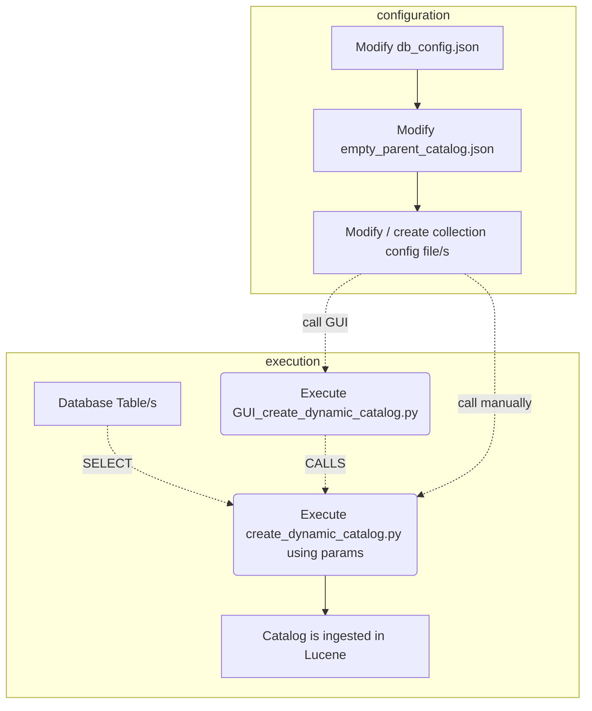

# Dynamic _Spatial Temporal Asset Catalog_ (STAC) Generation

## Table of Contents
- [Introduction](#introduction)
- [Workflow for Generation](#workflow-for-generation)
- [Configuration Files](#configuration-files)
- [Script Documentation](#script-documentation)
  - [Script Workflow](#script-workflow)
  - [Output](#output)

## Introduction
This documentation focuses on the generation of a dynamic [STAC](https://stacspec.org/en) (SpatioTemporal Asset Catalog) using a Python script called [`create_dynamic_catalog.py`](create_dynamic_catalog.py) using the [`pystac`](https://pystac.readthedocs.io/en/stable/) library.

Because the script generates the dynamic catalog based on configuration files, it relies heavily on these predefined JSON files.
- [`auth_data/conf.json`](config/auth_data/conf.json) defines information about the database connection - add your information in the template. The script has a flag _use_key_for_decryption_ which controlls whether to decrypt this config file using a key or not (default False).
- [`misc_config.json`](config/misc_config.json) includes a logging file path and the python file path.
- [`collection_config_files`](config/collection_config_files.json)
    - [`empty_parent_catalog`](config/empty_parent_catalog.json) is used to define root catalog properties and the SOLR connection.
    - [`stac_config_for_3_collections_example`](config/stac_config_for_3_collections_example.json) is an example of how a collection config can look.

The generation of the STAC relies on database tables (with geometry) defining the extent of the data. You can either have one one table per collection that defines the spatial and temporal extent of each item in the collection. Or you can use the WHERE statement in the config to include a subset of one table in one collection.

## Workflow for generation
Follow this workflow if you want to generate a new dynamic STAC based on your database tables. Modify the configuration files adhering to the documentation after the workflow diagram (using [Mermaid.js](https://mermaid.js.org/) for visualization):


## Configuration files

### empty_parent_catalog.json
The config file holds important information about the catalog itself.
- _href_ defines the URL to the existing API (if there is one).
- _catalog_id_ determines the id of the catalog.
- _title_ is the name or title of the catalog.
- _catalog_description_ describes the catalog.
<pre>
    {
    "href": "https://url.com/api/stac/v1/",
    "solr": "http://ip:port/suche/stac",
    "catalog_id": "my-catalog",
    "title": "Organisation Katalog",
    "catalog_description": "This is my Catalog containing ..."
    }
</pre>

### Collection config JSON files
You can define as many collection json files as you require. One config file can hold 1..n collection configurations. When executing the python script or the GUI you can choose which configs to incorporate in the generation.
#### Important contents:
- An array in the json file named _collections_ defines, which collections are generated based on which attributes/table.
- The (optional) object **_collection_template_** holds the object structure of each collection. The collection objects in the collection array overwrite this template if needed. This is handy if your collections within this config have many similar or the same fields as you only have to define it ones.
In the example collection config the template defines all attributes except coll_table_where, coll_id, coll_description and coll_title.

#### Attributes:
- **ignore_collection**:
Is a boolean value defining if a collection config should be ignored in the generation process.
- **overwrite_existing_collection**:
Is a boolean value defining if a collection should be overwritten during the generation process.
- **coll_table**: Is used to define the database scheme and tablename.
- **_coll_table_attributes_**: defines mapping of attribute names to table-column names. This is done in order to use the existing database column names without changing them or relying on the fact that all tables have the same column names.\
**The key is used in the script while the value is the name of the column in the database.**
- _coll_bs_date_format_ defines how the date column in the database is formatted.
- The keys with the prefix _item: are optional and hold columns informing about the item itself (for example which sensor was used item:sensor).
- The geometry is transformed to the World Geodetic System 1984 [World Geodetic System 1984](https://epsg.io/4326) as this is the standard CRS used in STACs
- The attribute srid holds the original CRS ID of the saved geometry.
- The attribute folder defines how the folder is called in which the resource-file is saved.
- The attribute filename defines how the resource-file is called.

The following attributes define further information about the collection. The [provider](https://pystac.readthedocs.io/en/stable/api/provider.html) array holds objects containing all involved instances and their roles **(possible values: PROCESSOR, LICENCOR, HOST, PRODUCER)**. Example:
<pre>
"coll_description": "Orthofotos des Flugblockes Klagenfurt",
"coll_title": "Orthofotos Flugblock Klagenfurt",
"coll_keywords": ["orthophotos", "orthoimage", "carinthia","klagenfurt"],
"coll_providers": [
    {
        "id": "KAGIS",
        "name": "Land Kärnten - KAGIS",
        "description": "Kontakt: kagis@ktn.gv.at",
        "roles": ["PROCESSOR", "LICENSOR"],
        "url": "https://kagis.ktn.gv.at"
    }
],
"coll_license": "CC-BY-4.0",
</pre>

The **assets** section of the collection definition handles the asset information.
- The id format is used to map the id from the database to the asset id. 
- The url holds the location of the data as the data itself is not saved in the catalog.
- The [media type](https://pystac.readthedocs.io/en/stable/_modules/pystac/media_type.html) defines the format of the asset data and the file type defines the file extension.

In the asset array _assets_, the information for generating individual assets is specified. Since an item in a collection can have more than one asset, multiple asset configurations can be specified in the configuration file. An asset has an ID format, which determines how the leaf node ID from the database should become the asset ID. Sometimes, the ID is directly taken from the database. For other assets, a suffix or prefix is added. The format might look like this: {id}_DOM or {id}_COG.

<pre>
{
    "id_format": "{id}_DOM",
    "file_name_format": "{id}_DOM",
    "url": "https://url_to_asset/{folder}{filename}DOM.tif",
    "filetype": ".tif",
    "title": "{id}_DOM",
    "roles": [
        "data"
    ],
    "description": "Digitales Oberflächenmodell (DOM/DSM)",
    "mediatype": "image/tiff; application=geotiff"
},
</pre>

It is also possible to define a thumbnail for the collection.
The thumbnail is defined in the collection array:
<pre>
"coll_thumbnail": {
    "key": "Vorschaubild",
    "asset": {
        "href": "https://url/thumbnail.png",
        "media_type": "image/png"
    }
},
</pre>

## Script Documentation
### Script Workflow
```mermaid
graph TD

C(Read Configuration Files) --> X
X[Read_parent_Catalog == True] -- Yes --> XX[Read Catalog from API] --> F
X -- No --> E(Create new STAC Catalog)
E --> F[Loop Collection-Config Array]
F --> Y[Overwrite Template with Collection-Config]
Y -->  G(Select Data from Database) --> H(Initialize Collection Object)

H --> I(Create STAC Items with Assets)
I --> L(Add Collection to Catalog)
L --> Q{Next Collection} -- Yes --> F
Q -- No --> O(Resolve Links)
O --> P(Index Catalog, COllections and Items)
P --> P4(SOLR Connection Commit)


````


### **Output**
The script adds the STAC to the Lucene Index based on the provided configuration and database data.

# GUI
The Graphical User Interface for the STAC generation is a simple Tkinter application that enables faster
STAC Generation. The collection config files can be chosen and all containing collections will be added to the STAC.